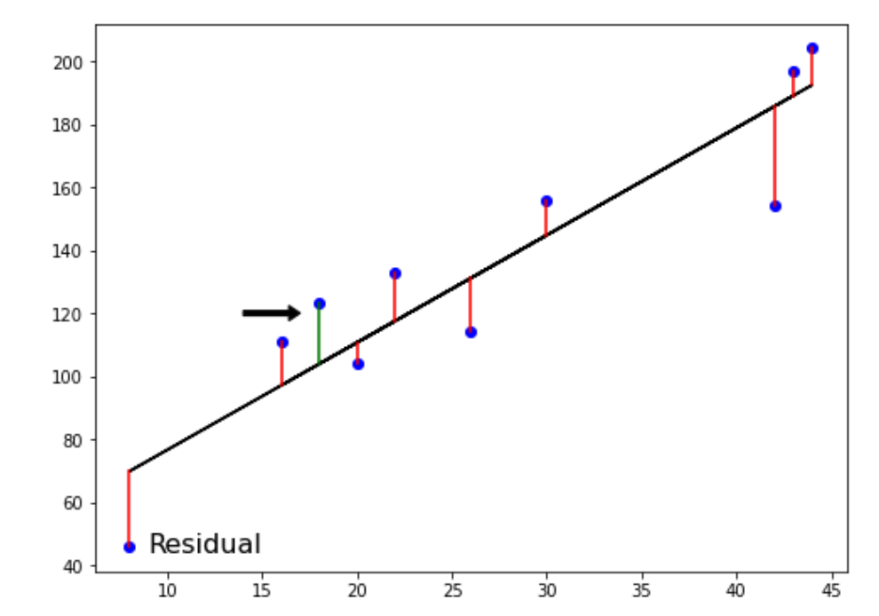
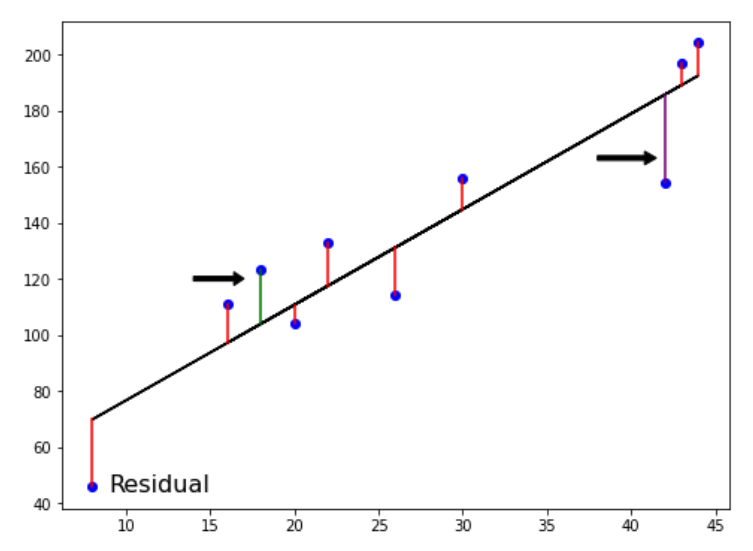
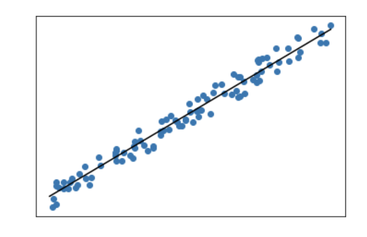
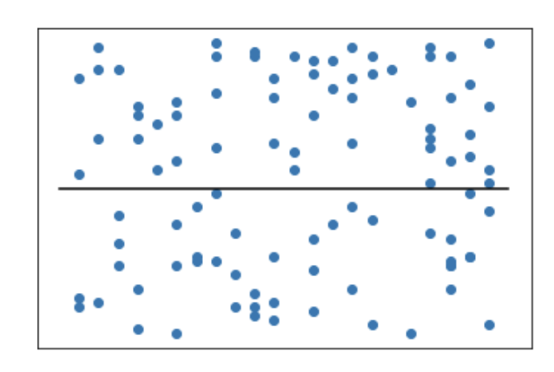
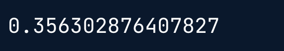
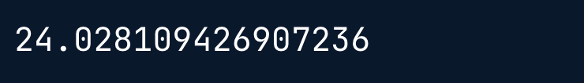

# Regresión

En este capítulo, te introducirás en la regresión y construirás modelos para predecir los valores de las ventas utilizando un conjunto de datos sobre gastos publicitarios. Aprenderás la mecánica de la regresión lineal y las métricas de rendimiento más comunes, como $R^2$ y el error cuadrático medio. Realizarás la validación cruzada K-fold y aplicarás la regularización a los modelos de regresión para reducir el riesgo de sobreajuste.

## Introducción a la regresión

-   Predicción de niveles de glucosa

```{python}
import pandas as pd
ruta = './data/Diabetes Clean Data.csv'
diabetes_df = pd.read_csv(ruta)
diabetes_df.head()
```

-   Creación de matrices de características y objetivos

```{python}
X = diabetes_df.drop('glucose', axis=1).values
y = diabetes_df['glucose'].values
print(type(X), type(y))
```

-   Predicciones a partir de una única característica

```{python}
X_bmi = X[:, 4]
print(y.shape, X_bmi.shape)
```

```{python}
X_bmi = X_bmi.reshape(-1, 1) # necesario para poder usarlo en scikit learn
print(X_bmi.shape)
```

-   Representación gráfica de la glucosa frente al índice de masa corporal

```{python}
import matplotlib.pyplot as plt

plt.scatter(X_bmi, y)
plt.ylabel('Blood Glucose (mg/dL)')
plt.xlabel('Body Mass Index')
plt.show()
```

-   Ajuste de un modelo de regresión

```{python}
from sklearn.linear_model import LinearRegression

reg = LinearRegression()
reg.fit(X_bmi, y)
predictions = reg.predict(X_bmi)

plt.scatter(X_bmi, y)
plt.plot(X_bmi, predictions)
plt.ylabel('Blood Glucose (mg/dL)')
plt.xlabel('Body Mass Index')
plt.show()
```

### Crear características

En este capítulo, trabajarás con un conjunto de datos llamado `sales_df`, que contiene información sobre el gasto en campañas publicitarias en distintos tipos de medios y el número de dólares generados en ventas por la campaña respectiva. Aquí tienes las dos primeras filas:

```{python}
#| echo: false
#| eval: true
ruta = './data/sales_df.csv'
sales_df = pd.read_csv(ruta)
sales_df.head(2)
```

Utilizarás los gastos de publicidad como características para predecir los valores de las ventas, trabajando inicialmente con la columna `"radio"`. Sin embargo, antes de hacer ninguna predicción, tendrás que crear la matriz de características y objetivos, dándoles el formato correcto para scikit-learn.

#### Instrucciones

-   Crea `X`, una matriz con los valores de la columna `"radio"` del DataFrame `sales_df`.

-   Crea `y`, una matriz con los valores de la columna `"sales"` del DataFrame `sales_df`.

-   Remodela `X` en una matriz NumPy bidimensional.

-   Imprime la forma de `X` y `y`.

```{python}
import numpy as np

# Create X from the radio column's values
X = sales_df['radio'].values

# Create y from the sales column's values
y = sales_df['sales'].values

# Reshape X
X = X.reshape(-1, 1)

# Check the shape of the features and targets
print(X.shape, y.shape)
```

### Construye un modelo de regresión lineal

Ahora que has creado tus matrices de características y objetivos, entrenarás un modelo de regresión lineal con todos los valores de las características y los objetivos.

Como el objetivo es evaluar la relación entre la característica y los valores objetivo, no es necesario dividir los datos en conjuntos de entrenamiento y prueba.

`X` y `y` se han precargado de la siguiente manera

```{python}
y = sales_df['sales'].values
X = sales_df['radio'].values.reshape(-1, 1) 
```

#### Instrucciones

-   Importa `LinearRegression`.

-   Instancia un modelo de regresión lineal.

-   Predice los valores de venta utilizando `X`, almacenando como `predictions`.

```{python}
# Import LinearRegression
from sklearn.linear_model import LinearRegression

# Create the model
reg = LinearRegression()

# Fit the model to the data
reg.fit(X, y)

# Make predictions
predictions = reg.predict(X)

print(predictions[:5])
```

Se observa cómo los valores de las ventas para las primeras cinco predicciones varían de \$95.000 a más de \$290.000.

### Visualizar un modelo de regresión lineal

Ahora que has construido el modelo de regresión lineal y lo has entrenado utilizando todas las observaciones disponibles, puedes visualizar lo bien que se ajusta el modelo a los datos. Esto te permite interpretar la relación entre el gasto en publicidad de `radio` y los valores de `sales`.

#### Instrucciones

-   Importa `matplotlib.pyplot` como `plt`.

-   Crea un gráfico de dispersión visualizando `y` frente a `X`, con las observaciones en azul.

-   Visualiza el gráfico.

```{python}
# Import matplotlib.pyplot
import matplotlib.pyplot as plt

# Create a scatter plot
plt.scatter(X, y, color='blue')

# Create line plot
plt.plot(X, predictions, color='red')
plt.xlabel('Radio Expenditure ($)')
plt.ylabel('Sales ($)')

# Display the plot
plt.show()
```

¡El modelo captura muy bien una correlación lineal casi perfecta entre el gasto en publicidad en radio y las ventas!


## Conceptos básicos de la regresión lineal

-   Mecánica de regresión

    -   $$ y = ax + b $$

        -   La regresión lineal simple utiliza una característica
            -   y = objetivo
            -   x = una característica
            -   a, b =. parámetros/coeficientes del modelo - pendiente, intercepto.

    -   ¿Cómo elegimos a y b?

        -   Se define una función de error para cualquier línea dada
        -   Se elige la línea que minimice la función de error

    -   Función de error = función de pérdida = función de coste

-   Función de pérdida

    {width="60%"}

-   Mínimos cuadrados ordinarios

    {width="60%"}

$$
RSS = \sum_{i=1}^n (y_i - \hat{y}_i)^2 
$$

## Conceptos básicos de regresión lineal

- Mecánica de Regresión

  - $y = mx + b$

    - La regresión lineal simple utiliza una característica

      - $y =$ Objetivo
      - $x =$ Una característica.
      - $a, b =$ parámetros/coeficientes del modelo - pendiente, intercepto.

  - ¿Cómo elegimos $a$ y $b$?

    - Se define una función de error para cualquier línea dada.
    - Se elige la línea que minimice la función de error.

  - Función de error = función de pérdida = función de coste

- La función de pérdida

{width="502"}

- Mínimos cuadrados ordinarios

  $RSS = \sum_{i=1}^{n}(y_i - \hat{y}_i)^2$

  Mínimos cuadrados ordinarios (MCO):

  minimizar el RSS

- Regresión lineal en dimensiones superiores

  $$
  y = a_1x_1 + a_2x_2 + b
  $$

  - Para ajustar aquí un modelo de regresión lineal:

    - Hay que especificar tres variables: $a_1, a_2, b$

  - En dimensiones superiores:

    - Se conoce como regresión múltiple.
    - Hay que especificar los coeficientes para cada característica y la variable $b$.

    $$
    y = a_1x_1 + a_2x_2 + a_3x_3 + ... + a_nx_n + b
    $$

  - Scikit-learn funciona exactamente igual:

    - Se pasan dos matrices: características y objetivo

- Regresión lineal utilizando todas las características

```{python}
#| eval: false
from sklearn.model_selection import train_test_split
from sklearn.linear_model import LinearRegression

X_train, X_test, y_train, y_test = train_test_split(X, y, test_size=0.3, random_state=42)

reg_all = LinearRegression()
reg_all.fit(X_train, y_train)
y_pred = reg_all.predict(X_test)

```

- R-cuadrado

  - $R^2$: Cuantifica la varianza de los valores objetivo explicada por las características.

    - El valor máximo es 1, pero puede ser negativo cuando el modelo obtiene un rendimiento peor que predecir la media.

  - $R^2$ alto:

    {width="353"}

  - $R^2$ bajo:

    {width="352"}

- R-cuadrado en scikit-learn

```{python}
#| eval: false
reg_all.score(X_test, y_test)
```

{width="207" height="37"}

- Error cuadrático medio y raíz del error cuadrático medio

  $MSE = \frac{1}{n}\sum_{i=1}^{n}(y_i - \hat{y}_i)^2$

  - El $MSE$ se mide en unidades objetivo, al cuadrado.

  $RMSE = \sqrt{MSE}$

  - El $RMSE$ se mide en las mismas unidades de la variable objetivo.

- RMSE en scikit-learn

```{python}
#| eval: false
from sklearn.metrics import root_mean_squared_error

root_mean_squared_error(y_test, y_pred)
```

{width="326"}

### Ajustar y predecir la regresión

Ahora que ya se ha visto cómo funciona la regresión lineal, la tarea consiste en crear un modelo de regresión lineal múltiple utilizando todas las características del conjunto de datos `sales_df`. A continuación se muestran las dos primeras filas.

```{python}
#| echo: false
sales_df = pd.read_csv('./data/sales_df.csv')
sales_df.head(3)
```
A continuación, utilizarás este modelo para predecir las ventas en función de los valores de las características de prueba.

#### Instrucciones

- Crea `X`, una matriz que contenga los valores de todas las características de `sales_df` y `y`, que contenga todos los valores de la columna `"sales"`.

- Instancia un modelo de regresión lineal.

- Ajusta el modelo a los datos de entrenamiento.

- Crea `y_pred`, haciendo predicciones para `sales` utilizando las características de prueba.

```{python}
from sklearn.model_selection import train_test_split

# Create X and y arrays 
X = sales_df.drop('sales', axis=1).values
y = sales_df['sales'].values

X_train, X_test, y_train, y_test = train_test_split(X, y, test_size=0.3, random_state=42)

# Instantiate the model 
reg = LinearRegression()

# Fit the model to the data
reg.fit(X_train, y_train)

# Make predictions
y_pred = reg.predict(X_test)
print("Predictions: {}, Actual Values: {}".format(y_pred[:2], y_test[:2]))
```
¡Las dos primeras predicciones parecen estar dentro de un 5% de los valores reales del conjunto de prueba!

### Rendimiento de la regresión

Ahora que has ajustado el modelo `reg` utilizando todas las características de `sales_df` y has hecho predicciones de los valores de ventas, puedes evaluar el rendimiento utilizando algunas métricas de regresión habituales.

La tarea consiste en averiguar lo bien que las características pueden explicar la varianza de los valores objetivo, además de evaluar la capacidad del modelo para hacer predicciones sobre datos no vistos.

#### Instrucciones

- Importa `root_mean_squared_error`.

- Calcula la puntuación $R^2$ del modelo pasando los valores de las características de prueba y los valores del objetivo de prueba a un método adecuado.

- Calcula el error cuadrático medio del modelo utilizando `y_test` y `y_pred`.

- Imprime `r_squared` y `rmse`.

```{python}
# Import root_mean_squared_error
from sklearn.metrics import root_mean_squared_error

# Calculate R-squared
r_squared = reg.score(X_test, y_test)

# Compute RMSE
rmse = root_mean_squared_error(y_test, y_pred)

# Print the metrics
print("R^2: {}".format(r_squared))
print("RMSE: {}".format(rmse))
```
¡Las características explican el 99.9% de la varianza en los valores de venta! 

## Validación cruzada

### Validación cruzada mediante R-cuadrado

### Analizar las métricas de validación cruzada

## Regresión regularizada

### Regresión regularizada: cresta

### Regresión Lasso para la importancia de las características
